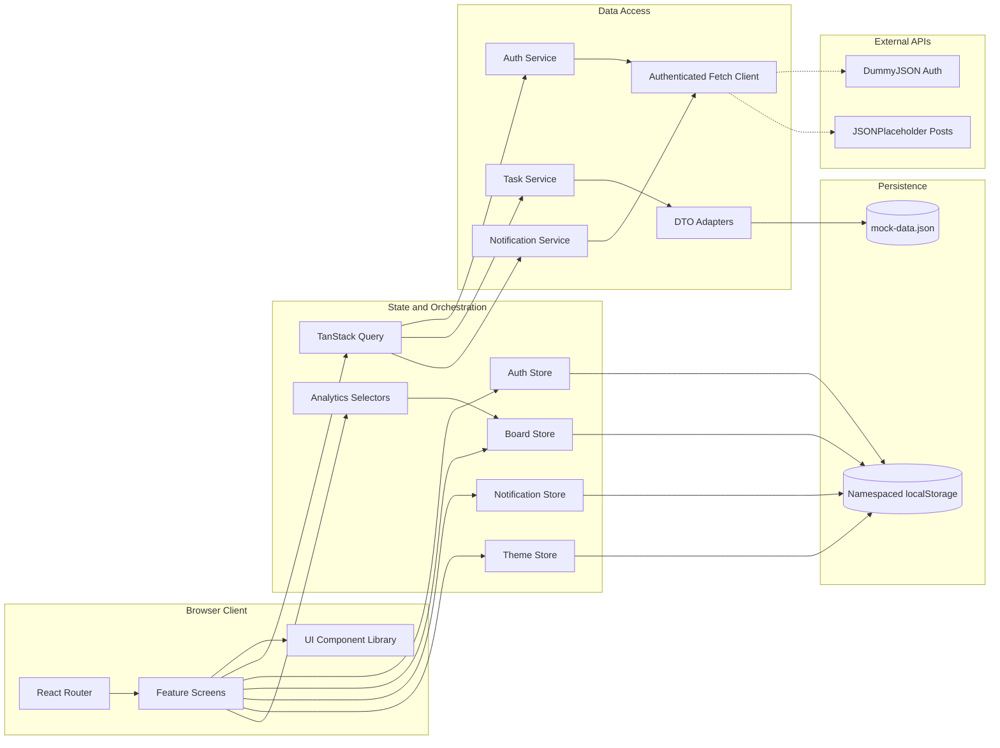
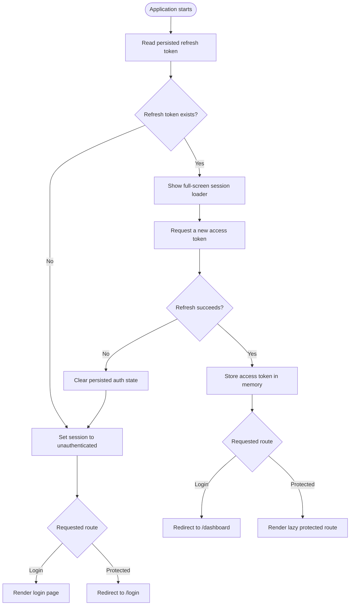
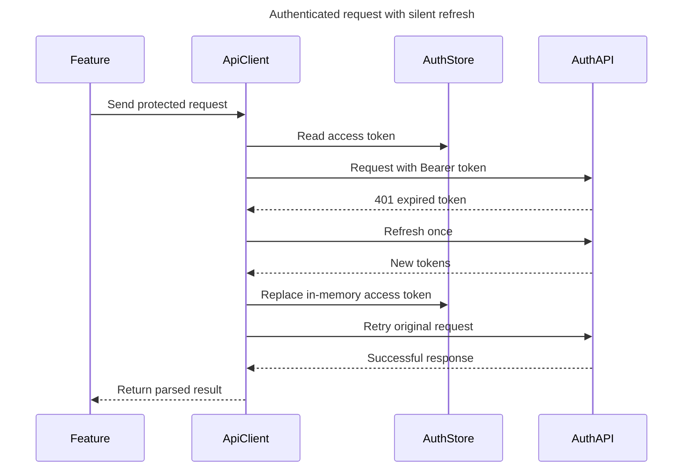
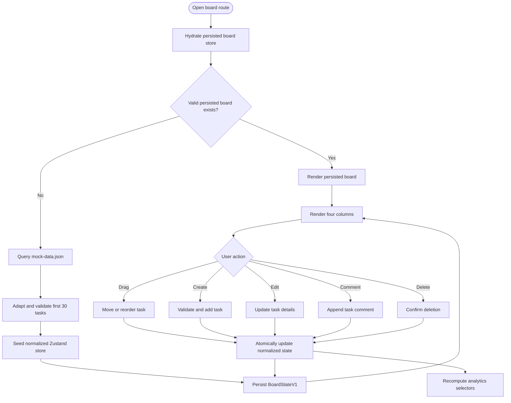
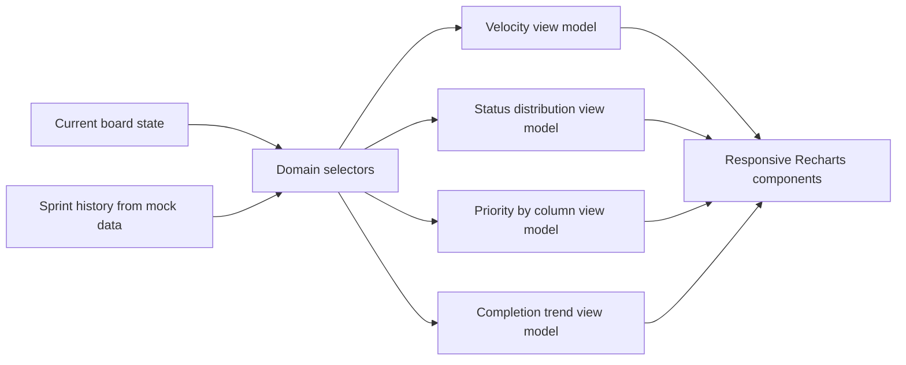
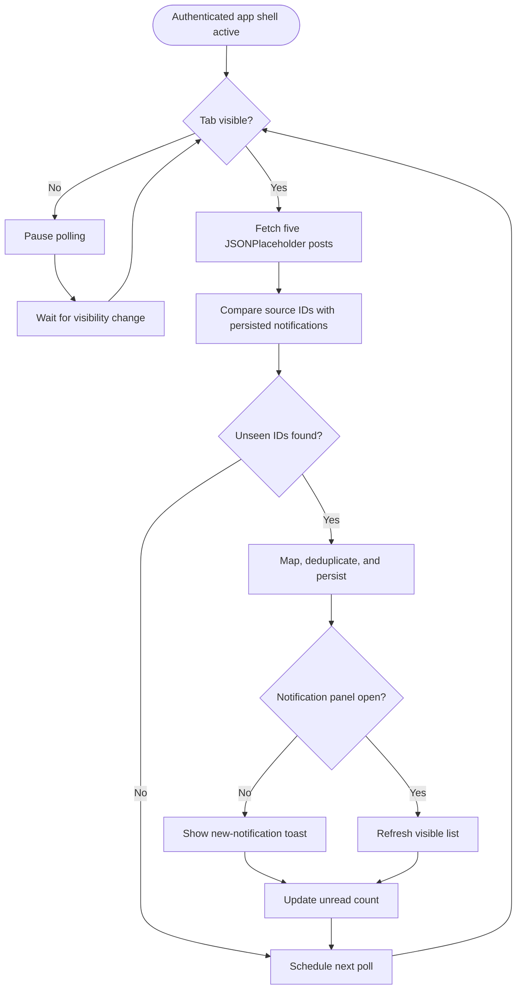
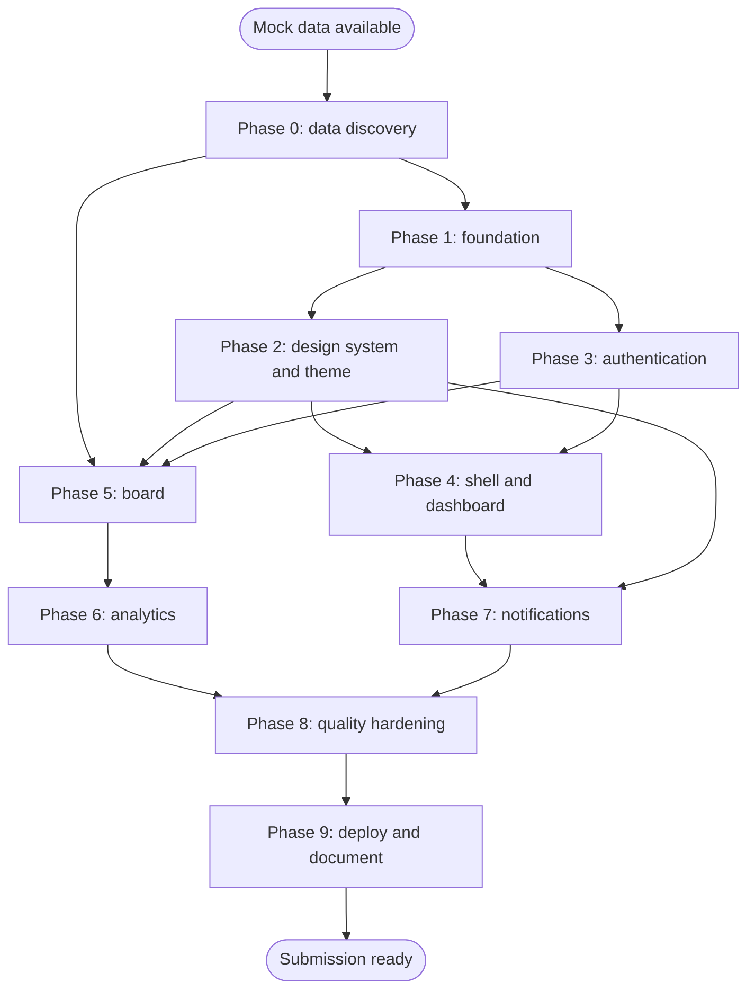

# SprintDesk Detailed Implementation Plan

## 1. Objective

Build a production-oriented sprint management single-page application that satisfies every mandatory requirement in the SprintDesk assignment while keeping the implementation focused, testable, accessible, and easy to replace with a real backend later.

The implementation is complete only when:

- Authentication, session restoration, refresh, retry, and logout work reliably.
- The four-column board supports persisted creation, editing, comments, deletion, and drag/reorder operations.
- Analytics are derived from the current application data and react immediately to board changes.
- Notifications poll, deduplicate, persist, paginate, and maintain read state.
- Light and dark themes work throughout the product.
- All four required routes are present and protected appropriately.
- Required design-system components are reusable and actually used.
- Required tests pass through `npm run test`.
- Production build, strict type checking, linting, Lighthouse targets, deployment, and documentation are complete.

## 2. Verified Inputs and Planning Decisions

### 2.1 Mock-data audit

The supplied source file is available at `/Users/shivanshrastogi/Downloads/mock-data.json`. It is valid JSON, approximately 15 KB, and contains every collection needed for the assignment. Its SHA-256 checksum is `1015e1bdc02d855b229122e164551b58a6993b9e3fbcf6568a185990d338157b`; use this to confirm the implementation copy remains unmodified.

| Collection | Count | Important fields |
|---|---:|---|
| Users | 6 | `id`, `name`, `email`, `avatar` |
| Sprints | 3 | `id`, `name`, `startDate`, `endDate` |
| Tasks | 30 | `id`, `title`, `description`, `status`, `priority`, `assigneeId`, `dueDate`, `sprintId`, `order`, timestamps |
| Comments | 5 | `id`, `taskId`, `authorId`, `message`, `createdAt` |
| Notifications | 4 | `id`, `title`, `message`, `type`, `read`, `createdAt` |

Verified source characteristics:

- Task IDs are unique integers from 1 through 30.
- All task-to-user, task-to-sprint, comment-to-task, and comment-to-author references are valid.
- There are no duplicate user or task IDs.
- Every Done task has `completedAt`; no incomplete task has `completedAt`.
- Task statuses are `backlog`, `in-progress`, `review`, and `done`.
- Task priorities are `low`, `medium`, and `high`; there is no `critical` value.
- The source includes enough completion history to build velocity and completion-trend charts without invented values.
- Sprint 3, dated 2026-08-17 through 2026-08-28, is the latest/current sprint in the supplied data.
- The 30 tasks include historical work from all three sprints, not only Sprint 3.
- The source `order` field is unique within most status/sprint groups but repeats across sprints, especially in Done. It must not be treated as a globally unique column position.

Implementation handling:

1. Copy the file unchanged to `public/mock-data.json` when implementation begins.
2. Keep numeric source DTO IDs, but adapt them to opaque string domain IDs with `String(id)`.
3. Map source status `in-progress` to domain status `inProgress`.
4. Map `avatar` to `avatarUrl`, comment `message` to `body`, and notification `read` to `readAt`.
5. Seed each board column by filtering the original task array in source order. After hydration, the Zustand `columnTaskIds` arrays become the only ordering authority.
6. Generate new client-side IDs with `crypto.randomUUID()`.

### 2.2 Recommended interpretations of underspecified requirements

| Topic | Recommended decision |
|---|---|
| Access token | Keep only in the in-memory auth store. Never persist it. |
| Refresh token | Persist in a namespaced local-storage record because the assignment explicitly requires this simulation. |
| Request interceptor | Implement a centralized fetch client with Bearer attachment, single-flight refresh, and one retry. |
| Simulated expiry | Store an in-memory expiry timestamp and use a configurable short development TTL. |
| Board initialization | Use TanStack Query to load and adapt the first 30 source tasks, then hydrate Zustand only if no valid persisted board exists. |
| Board persistence | Persist normalized tasks, column ordering, comments, and a schema version. |
| Analytics | Derive chart models from Zustand board selectors and source sprint history. Never store duplicate chart state. |
| First notification poll | Treat the five previously unseen JSONPlaceholder IDs as new notifications and merge them with the four initial mock notifications. Later identical polls are deduplicated. |
| Notification interval | Use a named constant, initially 20 seconds, and pause it while `document.hidden` is true. |
| Dashboard | Keep it minimal: sprint summary, status counts, upcoming/recent tasks, and navigation to board/analytics. |
| Responsive board | Use horizontally scrollable snap columns on narrow screens so cards remain usable. |
| UI dependencies | Do not use any external component library. Use internal primitives and inline SVG icons. |

## 3. Technology Decisions

### 3.1 Production dependencies

- React 18 and React DOM
- TypeScript strict mode
- Vite
- React Router v6
- TanStack Query v5
- Zustand
- Tailwind CSS v3
- `@dnd-kit/core`
- `@dnd-kit/sortable`
- `@dnd-kit/utilities`
- Recharts

`@dnd-kit/sortable` is an extension of the required drag-and-drop stack, not a UI component library. It provides sortable strategies and keyboard coordinates while `@dnd-kit/core` remains the underlying engine.

### 3.2 Development dependencies

- Vitest and jsdom
- React Testing Library
- `@testing-library/jest-dom`
- `@testing-library/user-event`
- ESLint with TypeScript and React rules
- PostCSS and Autoprefixer
- Optional after required work: axe-core for automated accessibility checks

### 3.3 Deliberately avoided dependencies

- Axios: a small fetch wrapper is enough and demonstrates the requested interception architecture.
- Form libraries: the forms are small enough to manage locally.
- Date libraries: native `Intl.DateTimeFormat` and ISO timestamps are sufficient.
- Icon libraries: inline SVG primitives avoid ambiguity around external component libraries.
- Runtime schema libraries: the verified source schema is small and can be validated by explicit adapter guards.

## 4. System Architecture



### 4.1 Core separation rules

- Screens render domain models, never raw JSON DTOs.
- TanStack Query owns asynchronous server state and request lifecycles.
- Zustand owns shared mutable client state and persistence.
- Local state owns transient form, drawer, modal, and pagination UI state.
- Recharts receives already-transformed chart view models.
- Services never import React components.
- Stores never directly render toasts or navigate; callers coordinate these effects.

## 5. Proposed Project Structure

```text
src/
  app/
    App.tsx
    providers/
      AppProviders.tsx
      QueryProvider.tsx
    router/
      AppRouter.tsx
      ProtectedRoute.tsx
      GuestOnlyRoute.tsx
    layout/
      AppShell.tsx
      Sidebar.tsx
      TopBar.tsx
      MobileNavigation.tsx
  components/
    ui/
      button/
      input/
      select/
      modal/
      drawer/
      toast/
      data-table/
      skeleton/
      icon/
  features/
    auth/
      api/
      components/
      hooks/
      pages/
      store/
      types/
    board/
      api/
      components/
      hooks/
      pages/
      selectors/
      store/
      types/
    analytics/
      components/
      pages/
      selectors/
      types/
    notifications/
      api/
      components/
      hooks/
      store/
      types/
    dashboard/
      components/
      pages/
    theme/
      components/
      store/
  services/
    api-client/
    storage/
  test/
    setup.ts
    fixtures/
    render.tsx
  types/
  utils/
public/
  mock-data.json
docs/
  ARCHITECTURE.md
  API.md
  ASSUMPTIONS.md
```

Keep feature-specific types, services, hooks, and components within their feature. Promote code to shared folders only after at least two real consumers exist.

## 6. Verified DTO, Domain, and Persistence Model

The source DTOs should reproduce the supplied file exactly:

```ts
interface MockUserDto {
  id: number;
  name: string;
  email: string;
  avatar: string;
}

interface MockSprintDto {
  id: number;
  name: string;
  startDate: string;
  endDate: string;
}

interface MockTaskDto {
  id: number;
  title: string;
  description: string;
  status: 'backlog' | 'in-progress' | 'review' | 'done';
  priority: 'low' | 'medium' | 'high';
  assigneeId: number;
  dueDate: string;
  sprintId: number;
  order: number;
  createdAt: string;
  completedAt: string | null;
  updatedAt: string;
}

interface MockCommentDto {
  id: number;
  taskId: number;
  authorId: number;
  message: string;
  createdAt: string;
}

interface MockNotificationDto {
  id: number;
  title: string;
  message: string;
  type: 'task' | 'review';
  read: boolean;
  createdAt: string;
}

interface MockDataDto {
  users: MockUserDto[];
  sprints: MockSprintDto[];
  tasks: MockTaskDto[];
  comments: MockCommentDto[];
  notifications: MockNotificationDto[];
}
```

The application-facing model normalizes identifiers, naming, and status values:

```ts
type TaskStatus = 'backlog' | 'inProgress' | 'review' | 'done';
type TaskPriority = 'low' | 'medium' | 'high';

interface Assignee {
  id: string;
  name: string;
  email: string;
  avatarUrl?: string;
}

interface Sprint {
  id: string;
  name: string;
  startDate: string;
  endDate: string;
}

interface TaskComment {
  id: string;
  taskId: string;
  authorId: string;
  body: string;
  createdAt: string;
}

interface SprintTask {
  id: string;
  title: string;
  description: string;
  status: TaskStatus;
  priority: TaskPriority;
  assigneeId: string;
  sprintId: string;
  dueDate: string;
  createdAt: string;
  updatedAt: string;
  completedAt: string | null;
}

interface BoardStateV1 {
  version: 1;
  tasksById: Record<string, SprintTask>;
  columnTaskIds: Record<TaskStatus, string[]>;
  commentsByTaskId: Record<string, TaskComment[]>;
  initializedFromSource: boolean;
}

interface AppNotification {
  id: string;
  source: 'mock' | 'jsonPlaceholder';
  sourceId: string;
  title: string;
  body: string;
  createdAt: string;
  readAt: string | null;
}
```

### 6.1 Adapter rules

Use a single `mapMockDataDto()` boundary that:

- Preserves source-array order while taking `tasks.slice(0, 30)`.
- Converts numeric IDs and foreign keys to strings.
- Converts `in-progress` to `inProgress`.
- Maps user `avatar` to `avatarUrl`.
- Maps comment `message` to `body`.
- Maps initial notification IDs to `mock:<id>` and sets `sourceId` to the same namespaced value.
- Converts `read: true` to `readAt: createdAt` and `read: false` to `readAt: null`.
- Rejects unknown status/priority values, duplicate IDs, invalid foreign keys, and invalid date strings with a descriptive data-load error.

For polled posts, use `jsonPlaceholder:<postId>` as the stable source ID. This prevents collisions with initial mock-notification IDs and guarantees deduplication across polls.

The raw task `order` can be retained only as source metadata or discarded after adaptation. Initial `columnTaskIds` must be built from source-array order because `order` repeats across sprint boundaries.

### 6.2 Storage keys

Use versioned, application-specific keys:

```text
sprintdesk.auth.refresh.v1
sprintdesk.board.v1
sprintdesk.notifications.v1
sprintdesk.theme.v1
```

Persist only explicitly selected fields. Do not persist transient loading flags, current drag state, modal state, query results, or the access token.

## 7. Application Route and Session Flow



### 7.1 Authenticated API refresh flow



### 7.2 Required auth implementation details

1. Model auth status as `unknown | validating | authenticated | unauthenticated`.
2. Validate session before rendering route decisions.
3. Validate login inputs and show inline errors.
4. Map DummyJSON responses through `authService`.
5. Store the access token and expiry only in memory.
6. Store the refresh token through an isolated storage adapter.
7. Use one shared `refreshPromise` for concurrent 401 responses.
8. Tag retried requests so they cannot trigger an infinite refresh loop.
9. On refresh failure, clear all auth state and navigate to `/login`.
10. On logout, clear memory, persisted refresh state, and sensitive query cache entries.

### 7.3 Auth acceptance criteria

- Direct navigation to a protected URL redirects guests to `/login`.
- A valid refresh token restores the session after a full browser refresh.
- A missing or invalid refresh token produces a clean guest session.
- An authenticated user visiting `/login` is redirected to `/dashboard`.
- A protected request includes exactly one Bearer header.
- Concurrent 401 responses trigger one refresh operation.
- The original request is retried once after refresh.
- Refresh failure cannot loop and always logs the user out.
- Logout leaves no access token, refresh token, or authenticated user state.

## 8. Board Data and Interaction Flow



### 8.1 Board store operations

Implement and test explicit store actions:

- `initializeBoard(sourceTasks, comments)`
- `addTask(input)`
- `updateTask(taskId, patch)`
- `deleteTask(taskId)`
- `addComment(taskId, input)`
- `moveTask({ taskId, fromStatus, toStatus, toIndex })`
- `reorderTask({ status, activeIndex, overIndex })`
- `setHydrated(value)`
- Optional after required work: `undoLastMove()`

Every action must preserve these invariants:

- A task ID appears in exactly one column list.
- Every column ID points to a task in `tasksById`.
- Deleted tasks do not retain orphaned comments or column references.
- Column counts equal the corresponding ID-array lengths.
- Moving to Done updates completion metadata according to the documented rule.
- Invalid IDs or destinations do not partially mutate state.

### 8.2 Drag-and-drop implementation

1. Render a single `DndContext` around all four columns.
2. Configure pointer and keyboard sensors.
3. Use a stable task ID as the draggable ID.
4. Give each column a droppable target, including empty columns.
5. Use a vertical sorting strategy within each column.
6. Store only the active task ID locally while dragging.
7. Show a `DragOverlay` without changing persisted state.
8. On drag end, determine source, destination, and insertion index.
9. Dispatch one atomic board-store action.
10. Announce the move through the dnd-kit accessibility API.

### 8.3 Board UI composition

- Board toolbar: title, task count, create button, optional bonus filters.
- Column: title, count, droppable region, empty state.
- Task card: title, priority badge, assignee, due date, drag handle.
- Task drawer: details, edit form, comments, delete action.
- Create modal: title, priority, assignee, due date, optional description.
- Delete modal: destructive confirmation with task title.

### 8.4 Validation and date behavior

- Trim titles and reject empty values.
- Treat task IDs as opaque strings.
- Store dates as ISO strings and format only at render time.
- Show overdue dates using both color and text/icon treatment.
- Do not allow unknown assignee IDs or priorities.
- Keep comments non-empty and timestamped.
- Ensure destructive actions require explicit confirmation.

### 8.5 Board acceptance criteria

- Exactly the first 30 adapted tasks seed a fresh board.
- Reloading the page preserves task ordering and edits.
- Tasks can move within and between every column, including empty columns.
- Creation, editing, comments, and deletion update immediately.
- Counts update after every relevant action.
- Drawer and modals are keyboard accessible and restore focus.
- A 375px viewport preserves readable cards and usable drag targets.
- Analytics update immediately after a board mutation.

## 9. Analytics Plan

### 9.1 Selector pipeline



### 9.2 Chart definitions

| Requirement | Recommended chart | Source |
|---|---|---|
| Sprint velocity | Bar chart | Completed tasks grouped by sprint |
| Task status | Donut or horizontal bar | Current column counts |
| Priority breakdown | Stacked bar | Priority counts grouped by current column |
| Completion trend | Line/area chart | Completed tasks grouped by completion date |

### 9.3 Verified analytics baseline

The following values are expected from an unmodified, freshly loaded source file and should be used as selector-test assertions, not hardcoded UI data:

| Dataset | Expected source-derived result |
|---|---|
| Sprint velocity | Sprint 1: 5; Sprint 2: 7; Sprint 3: 6 |
| All-task status | Backlog: 3; In Progress: 5; Review: 4; Done: 18 |
| Current Sprint 3 status | Backlog: 3; In Progress: 5; Review: 4; Done: 6 |
| All-task priority | High: 13; Medium: 12; Low: 5 |
| Backlog priorities | Medium: 2; Low: 1; High: 0 |
| In Progress priorities | High: 3; Medium: 2; Low: 0 |
| Review priorities | High: 2; Medium: 2; Low: 0 |
| Done priorities | High: 8; Medium: 6; Low: 4 |
| Completion history | 18 completed tasks across 14 distinct completion dates |

The dashboard should identify the current sprint as the sprint with the latest `startDate`, which resolves to Sprint 3. The board still loads all first 30 tasks because that is the explicit assignment requirement. Do not silently filter the board to Sprint 3.

### 9.4 Analytics implementation rules

- Build each chart view model with a pure, independently tested selector.
- Do not hardcode chart values.
- Use the current board store for status and priority data.
- Use the verified sprint and completion history for velocity and trend data.
- When moving a task into Done, set `completedAt` to the current ISO timestamp if it is null.
- When moving a task out of Done, clear `completedAt` so the current application state remains internally consistent with the supplied source invariant.
- Provide a visible empty state if a chart has no meaningful data.
- Provide textual summaries for screen-reader and no-chart contexts.
- Keep legends, tooltip values, and colors consistent across themes.
- Reduce tick density on small screens.
- Respect `prefers-reduced-motion` by disabling or minimizing animations.

### 9.5 Analytics acceptance criteria

- Every chart is derived from board or source data.
- Moving a task changes the relevant status and priority visualization without reload.
- Completion changes affect trend and velocity according to the explicit `completedAt` rules above.
- Charts remain readable at 375px and in both themes.
- Every chart has a title, accessible description, tooltip, empty state, and formatted values.

## 10. Notification Flow



### 10.1 Notification responsibilities

TanStack Query owns:

- Polling interval and visibility behavior
- Fetch lifecycle and error state
- Refetching when the tab becomes visible

Zustand owns:

- Notification collection
- Source-ID deduplication
- Read/unread timestamps
- Unread count selector
- Latest-first ordering
- Local-storage persistence

Local component state owns:

- Bell panel open/closed state
- Current pagination page
- Temporary focus position

### 10.2 Notification acceptance criteria

- Repeated posts never create duplicate notifications.
- The unread badge matches unread persisted items.
- Mark-one and mark-all operations persist after reload.
- The panel displays at most 20 items per page.
- Pagination appears only when more than 20 items exist.
- Hidden tabs do not continue polling.
- Returning to the tab triggers a timely refetch.
- New notifications show a toast only while the panel is closed.
- Poll failures produce a non-blocking error and retain existing notifications.

Verified fresh-state behavior:

- Four notifications seed from the mock source, three unread and one read.
- The first successful JSONPlaceholder poll contributes five unseen items.
- After that merge, the expected collection contains nine items and eight unread items.
- Later identical polls keep the collection at nine because source IDs 1–5 are deduplicated.
- Pagination must still be implemented and tested with a store fixture containing more than 20 items, even though the supplied data and static polling endpoint do not naturally reach that threshold.

## 11. Design System Plan

### 11.1 Foundation tokens

Define semantic Tailwind tokens rather than spreading raw colors through features:

- Background, surface, elevated surface
- Text primary, secondary, muted, inverse
- Border, focus ring
- Brand, success, warning, danger, information
- Priority colors
- Status colors
- Spacing, radius, shadow, and motion conventions

### 11.2 Required components and consumers

| Component | Variants/states | Product usage |
|---|---|---|
| Button | Primary, secondary, ghost, danger, loading, disabled | Forms, toolbar, modal actions |
| Input | Label, hint, error, disabled | Login and task forms |
| Select | Label, placeholder, error, disabled | Priority and assignee fields |
| Modal | Sizes, focus trap, Escape, backdrop | Create and delete flows |
| Toast | Success, error, info, auto-dismiss, live region | Mutations and notifications |
| DataTable | Columns, empty, loading, responsive overflow | Dashboard task summary |
| Skeleton | Text, card, chart, table | Route and query loading |
| Drawer | Focus trap, responsive full-screen mode | Task details and comments |

### 11.3 Component requirements

- Forward refs where a caller needs focus control.
- Use native HTML semantics first.
- Every interactive state has visible hover, active, focus, and disabled styles.
- Error messaging is linked with `aria-describedby`.
- Modals and drawers use `aria-modal`, labelled headings, focus trap, and focus restoration.
- Toast container uses an appropriate live region without stealing focus.
- No component is added unless used or required.

## 12. Responsive Layout Plan

### 12.1 Breakpoints

- Mobile baseline: 375px and upward
- Compact/tablet: approximately 640–1023px
- Desktop: 1024px and upward

### 12.2 Route behavior

| Route | Mobile behavior |
|---|---|
| Login | Single centered form with safe viewport padding |
| Dashboard | One-column cards, horizontally scrollable table if required |
| Board | 85–90vw snap columns with horizontal scrolling |
| Analytics | One chart per row, reduced labels and legends |
| Notifications | Full-width anchored sheet or bounded popover |
| Task drawer | Full-screen panel on small screens |

Avoid hiding required information on mobile. Reflow or scroll deliberately instead.

## 13. Detailed Implementation Phases

Estimates assume one experienced developer, the mock data is supplied, and no major API contract changes occur.

### Phase 0: source-data integration and adapter tests

Estimate: 1–2 hours

Tasks:

- Add the unmodified `mock-data.json` under `public/`.
- Implement the verified source DTO types from Section 6.
- Implement string-ID, naming, status, and notification adapters.
- Build initial column arrays from source-array order.
- Add adapter tests for the known counts, relationships, and analytics baseline.
- Record the confirmed source decisions in `docs/ASSUMPTIONS.md`.
- Confirm actual DummyJSON token and refresh response contracts before coding the client.

Exit criteria:

- The data model is based on evidence from the supplied file.
- All required charts can be mapped to actual fields or have a documented derivation rule.
- No feature component imports source DTOs directly.

### Phase 1: project foundation

Estimate: 3–4 hours

Tasks:

- Scaffold Vite React TypeScript.
- Enable strict TypeScript and useful no-unused rules.
- Configure Tailwind dark mode and semantic tokens.
- Configure ESLint, Vitest, jsdom, and testing setup.
- Add QueryClient and application providers.
- Configure router and lazy route modules.
- Add error boundary and route-level suspense fallback.
- Create path aliases only if they simplify imports consistently.

Exit criteria:

- `npm run dev`, `npm run test`, `npm run typecheck`, and `npm run build` work.
- All four route modules load lazily.
- No feature logic exists in provider or router files.

### Phase 2: design system and theme

Estimate: 5–7 hours

Tasks:

- Implement Button, Input, Select, Modal, Toast, DataTable, Skeleton, Drawer, and icon primitive.
- Build focus and keyboard behavior before visual polish.
- Add persisted theme store and system-preference initialization.
- Verify every primitive in light and dark modes.
- Add focused component tests for modal focus, form labelling, and toast behavior.

Exit criteria:

- Required primitives are reusable and accessible.
- `useToast` unit tests pass.
- Theme persists without a visible theme flash.

### Phase 3: authentication and route protection

Estimate: 6–8 hours

Tasks:

- Build storage adapter, auth service, auth store, and API client.
- Implement login form and API error handling.
- Implement session validation and restoration.
- Add protected and guest-only route guards.
- Implement single-flight refresh and one-time request retry.
- Implement logout and query-cache cleanup.
- Add required interceptor tests.

Exit criteria:

- All auth acceptance criteria in Section 7.3 pass.
- Direct URL navigation and reload behave correctly.
- Access tokens never appear in persisted storage.

### Phase 4: application shell and dashboard

Estimate: 3–4 hours

Tasks:

- Build responsive sidebar/top bar/mobile navigation.
- Add route navigation, user menu, theme toggle, notification slot, and logout.
- Add dashboard summary cards and a task DataTable backed by real state.
- Implement loading, empty, and error states.

Exit criteria:

- Navigation is keyboard accessible.
- Dashboard content is real and within assignment scope.
- DataTable is not dead-code demonstration content.

### Phase 5: board feature

Estimate: 10–14 hours

Tasks:

- Implement task query, DTO adapters, and one-time Zustand initialization.
- Build normalized persisted board store and selectors.
- Render columns, cards, counts, empty states, and skeletons.
- Add pointer and keyboard drag-and-drop.
- Build create form, details drawer, edit form, comment list/form, and delete confirmation.
- Add responsive board layout.
- Write store and critical interaction tests.

Exit criteria:

- All board acceptance criteria in Section 8.5 pass.
- Required add/move/delete store tests pass.
- Refreshing preserves mutations and ordering.

### Phase 6: analytics feature

Estimate: 5–7 hours

Tasks:

- Implement pure selectors for four datasets.
- Add responsive chart-card shell and accessible descriptions.
- Implement velocity, status, priority, and completion charts.
- Handle no-data and partial-history cases.
- Verify live updates after board mutations.
- Apply reduced-motion behavior.

Exit criteria:

- All analytics acceptance criteria in Section 9.5 pass.
- No chart contains hardcoded business values.

### Phase 7: notifications

Estimate: 4–6 hours

Tasks:

- Implement post service and Query polling hook.
- Add visibility-aware pause/resume behavior.
- Implement notification store, deduplication, persistence, and selectors.
- Build bell, unread badge, panel, read actions, pagination, and toast coordination.
- Test store behavior and visibility flow where practical.

Exit criteria:

- All notification acceptance criteria in Section 10.2 pass.
- Polling does not create duplicates or run in hidden tabs.

### Phase 8: integration, accessibility, and performance

Estimate: 5–8 hours

Tasks:

- Perform full keyboard walkthrough.
- Verify focus traps, focus restoration, live regions, labels, contrast, and reduced motion.
- Test 375px, tablet, desktop, and zoomed layouts.
- Audit memoization and remove unnecessary memoization.
- Inspect route bundles and ensure charts are lazy-loaded.
- Run Lighthouse against the production deployment.
- Fix console warnings, failed requests, layout shifts, and contrast issues.
- Remove dead code and unused dependencies.

Exit criteria:

- Lighthouse Performance is at least 88.
- Lighthouse Accessibility is at least 92.
- No severe automated or manual accessibility failures remain.
- Production build has no console errors or TypeScript errors.

### Phase 9: documentation, deployment, and demo

Estimate: 4–6 hours

Tasks:

- Complete README with links, credentials, setup, scripts, features, assumptions, limitations, and test instructions.
- Complete `docs/ARCHITECTURE.md` and `docs/API.md`.
- Add deployment SPA fallback configuration.
- Deploy and verify direct navigation to every route.
- Record Lighthouse results.
- Record a concise feature and architecture walkthrough.
- Verify all public links in an incognito browser.

Exit criteria:

- A reviewer can clone, install, run, test, and understand the project without assistance.
- Repository, deployment, and video are public and accessible.
- All links are collected in the README.

## 14. Dependency and Delivery Flow



Critical path:

```text
Mock data -> data model -> foundation -> auth/design system -> board -> analytics -> hardening -> release
```

The board and analytics should not be started against an invented source schema.

## 15. Testing Strategy

### 15.1 Test pyramid

1. Pure unit tests for adapters, selectors, store actions, storage helpers, and API-client retry logic.
2. Component tests for forms, modals, drawer, notification panel, and board interactions.
3. A small number of route integration tests for auth protection and session restoration.
4. Manual production checks for drag-and-drop, responsive behavior, Lighthouse, and deployment routing.

### 15.2 Mandatory test matrix

| Area | Required scenarios |
|---|---|
| `useToast` | Add, remove, auto-dismiss, maximum stack if implemented, accessible message |
| Board add | Valid task inserted in correct column, count updated, invalid task rejected |
| Board move | Same-column reorder, cross-column move, empty destination, invalid ID |
| Board delete | Task removed, ordering cleaned, comments cleaned, counts updated |
| Auth client | Bearer attachment, refresh on expiry/401, one retry, refresh failure |

### 15.3 Recommended additional tests

- Persisted board is not overwritten by initial query data.
- Duplicate notification source IDs are ignored.
- Mark-one and mark-all update unread count.
- Analytics selectors return correct aggregations.
- Guest and protected route redirects work.
- Modal and drawer restore focus after closing.
- Login form exposes validation errors accessibly.

### 15.4 Test fixtures

Create minimal, explicit fixtures rather than importing the entire mock file into every test:

- Four tasks spanning all statuses and priorities
- Three users/assignees
- Two sprints with completion dates
- A few comments
- Duplicate and unseen notification posts
- Valid, expired, and rejected token responses

## 16. Accessibility Checklist

### Global

- One logical page heading per route.
- Skip link to main content.
- Semantic landmarks for navigation, main content, and complementary panels.
- Visible focus indicators in both themes.
- Minimum target sizes appropriate for touch.
- No interaction that requires only color, hover, or precise pointer movement.

### Forms

- Every field has a programmatic label.
- Required and invalid states are announced.
- Validation messages are connected to fields.
- Submission failures do not clear user input.
- Focus moves to the first invalid field where appropriate.

### Board

- Keyboard sensor and drag handle labels.
- Movement announcements include task and destination.
- Non-drag actions remain available through buttons/forms.
- Horizontal scrolling does not trap keyboard focus.

### Modal and drawer

- Labelled dialog semantics.
- Initial focus placed intentionally.
- Tab focus contained while open.
- Escape closes when safe.
- Trigger focus restored on close.

### Charts

- Human-readable chart title and summary.
- Tooltips are not the only way to access values.
- Palette has adequate contrast and is not color-only.
- Animations respect reduced-motion preferences.

## 17. Performance Plan

- Lazy-load dashboard, board, and analytics route modules.
- Ensure Recharts is included only in the analytics chunk.
- Keep source-to-domain transformation outside render loops.
- Use Zustand selectors that subscribe to the smallest required slice.
- Use `React.memo`, `useMemo`, and `useCallback` only when they prevent measured or obvious repeated work.
- Avoid recreating chart datasets and dnd sensor configuration unnecessarily.
- Use system fonts and lightweight inline icons.
- Reserve stable dimensions for charts and skeletons to limit layout shift.
- Do not persist query caches unless explicitly justified.
- Set sensible TanStack Query stale times and retry policies per endpoint.
- Measure the deployed production build, not the development server.

## 18. Error and Edge-Case Plan

### Authentication

- Invalid credentials
- Offline login
- Expired access token
- Invalid or missing refresh token
- Concurrent 401 responses
- Refresh request itself returning 401
- Logout while a request is in flight

### Board

- Empty board and empty columns
- Fewer than 30 source tasks
- Duplicate source task IDs
- Drag canceled or dropped outside a column
- Drag into an empty column
- Deleting the currently open task
- Invalid due date or assignee
- Corrupt/old local-storage state

### Analytics

- No completed tasks
- Missing sprint history
- Missing completion dates
- One-point trend dataset
- Long labels on a 375px viewport

### Notifications

- Repeated identical API results
- More than 20 persisted items
- Polling error and recovery
- Hidden tab during scheduled polling
- Corrupt persisted notifications
- New items arriving while panel state changes

## 19. Documentation Plan

### README.md

- Product overview
- Live deployment link
- Demo video link
- Test credentials
- Feature checklist separating required and bonus work
- Technology choices
- Local setup and scripts
- Environment variables or an explicit statement that none are required
- Architecture summary
- Data-source explanation
- Auth simulation/security disclaimer
- Assumptions and known limitations
- Test and Lighthouse results

### docs/ARCHITECTURE.md

- System diagram
- Route structure
- State ownership table
- Authentication lifecycle
- Board persistence lifecycle
- Analytics derivation
- Notification polling lifecycle
- Important architectural decisions and tradeoffs

### docs/API.md

- DummyJSON login and refresh contracts actually consumed
- JSONPlaceholder polling endpoint
- Static mock-data contract
- Headers, request/response examples, and error handling
- Retry and polling behavior

Do not create fictional API endpoints merely to make the documentation look larger.

## 20. Deployment Plan

1. Select a static SPA host such as Vercel, Netlify, or Cloudflare Pages.
2. Configure all non-asset routes to fall back to `index.html`.
3. Set the production build command to `npm run build` and output to `dist`.
4. Verify `/login`, `/dashboard`, `/board`, and `/analytics` via direct browser navigation.
5. Verify external API CORS behavior on the deployed origin.
6. Test local-storage persistence and logout on the deployed build.
7. Run Lighthouse in an incognito session against the deployed URL.
8. Record the final Lighthouse results and environment in the README.

## 21. Git and Review Strategy

Use small, reviewable commits organized by behavior:

1. `chore: scaffold strict vite application`
2. `feat: add application providers and lazy routes`
3. `feat: build accessible ui primitives and theme`
4. `feat: implement authentication lifecycle`
5. `test: cover auth refresh and retry behavior`
6. `feat: add responsive application shell`
7. `feat: initialize persisted board state`
8. `feat: add kanban drag and reorder behavior`
9. `feat: add task details and mutations`
10. `test: cover board store operations`
11. `feat: add reactive sprint analytics`
12. `feat: add polling notifications`
13. `test: cover toast and notification behavior`
14. `perf: optimize route bundles and rendering`
15. `docs: complete architecture and submission guide`

Before each feature commit:

- Run focused tests.
- Run TypeScript checking.
- Remove temporary logs and dead imports.

Before submission:

- Run the complete validation suite.
- Review the dependency list for unused packages.
- Inspect the public repository in an incognito window.

## 22. Demo Recording Script

Target a concise 6–9 minute recording unless the recruiter specifies otherwise.

1. Show the README and identify the deployed URL.
2. Open a protected route as a guest and show the redirect.
3. Log in and briefly explain access-token memory storage and refresh-token simulation.
4. Demonstrate the protected shell, theme toggle, and responsive navigation.
5. Create a task and show it on the board.
6. Drag the task within and between columns.
7. Edit details, add a comment, and demonstrate deletion confirmation on another task.
8. Refresh the page to demonstrate persistence.
9. Open analytics and show that board mutations changed the charts.
10. Open notifications, mark one and all as read, and show pagination if fixture data permits.
11. Show the mobile layout at 375px.
12. End with tests, architecture documentation, and Lighthouse scores.

## 23. Risk Register

| Risk | Impact | Mitigation |
|---|---|---|
| Duplicate raw `order` values across sprints | Incorrect Done-column ordering | Preserve source-array order initially; make `columnTaskIds` authoritative |
| DummyJSON contract differs from assumptions | Auth failure | Verify live contract and keep it behind `authService` |
| Static notification results | Weak live demo | Implement honest ID comparison and document limitation |
| Numeric source IDs conflict with client-created IDs | Overwritten records | Convert all domain IDs to strings and use namespaced UUIDs |
| Remote avatar host is slow or unavailable | Layout shift and Lighthouse noise | Set dimensions, lazy load, and provide initials fallback |
| Board/query ownership conflict | Persisted state overwritten | One-time initialization gated by hydration/version flags |
| Concurrent token refresh | Duplicate requests and race conditions | Single shared refresh promise and one-retry marker |
| DnD on mobile/keyboard | Accessibility or usability failure | Keyboard sensor, drag handle, mobile scroll strategy |
| Recharts bundle size | Lighthouse regression | Lazy analytics route and minimize initial assets |
| Custom modal/select defects | Accessibility failure | Native semantics, focused tests, manual keyboard audit |
| Scope expansion | Incomplete required features | Freeze bonus work until Definition of Done is satisfied |

## 24. Recommended Bonus Gate

Do not begin bonus features until all required tests, build checks, responsive checks, and Lighthouse targets pass.

Recommended bonus order:

1. Keyboard-accessible drag-and-drop, because it reinforces accessibility.
2. axe-core accessibility tests.
3. Priority and assignee board filters.
4. Undo last drag action using one previous-position snapshot.
5. Remember Me simulation.
6. Custom analytics date range.
7. Analytics PNG export.
8. Storybook only if substantial time remains.

The password-strength bonus has little product value for a login-only flow and should be deprioritized.

## 25. Final Definition of Done

### Functional

- [ ] Login, refresh, restoration, route guards, and logout work.
- [ ] Four board columns load the first 30 source tasks.
- [ ] Tasks reorder within and across columns.
- [ ] Board state persists after refresh.
- [ ] Task create, view, edit, comment, and delete flows work.
- [ ] All four required analytics update from real state.
- [ ] Notifications poll, deduplicate, persist, paginate, and track read state.
- [ ] Light and dark themes work on every route.
- [ ] `/login`, `/dashboard`, `/board`, and `/analytics` exist.

### Architecture

- [ ] Server, client, and local state are clearly separated.
- [ ] UI is not coupled to raw mock-data structures.
- [ ] API access is centralized.
- [ ] Persisted schemas and storage keys are versioned.
- [ ] No duplicate or unused components, utilities, or dependencies remain.

### Quality

- [ ] `npm run lint` passes.
- [ ] `npm run typecheck` passes.
- [ ] `npm run test` passes.
- [ ] `npm run build` passes.
- [ ] Required tests cover toast, board store, and auth refresh/retry.
- [ ] No console errors or React warnings remain.
- [ ] Lighthouse Performance is at least 88.
- [ ] Lighthouse Accessibility is at least 92.

### Accessibility and responsive design

- [ ] Complete keyboard walkthrough succeeds.
- [ ] Modal, drawer, select, toast, and DnD behaviors are accessible.
- [ ] Both themes meet contrast expectations.
- [ ] Routes work at 375px without clipped required content.
- [ ] Reduced-motion behavior is respected.

### Submission

- [ ] Public repository is accessible.
- [ ] Live deployment is accessible and supports direct route navigation.
- [ ] README includes all required links and setup instructions.
- [ ] Architecture and API documentation are complete.
- [ ] No secrets or credentials are committed.
- [ ] Demo recording covers features, APIs, and implementation decisions.

## 26. Total Estimate

| Workstream | Estimate |
|---|---:|
| Data discovery and foundation | 5–7 hours |
| Design system and theme | 5–7 hours |
| Authentication | 6–8 hours |
| Shell and dashboard | 3–4 hours |
| Board | 10–14 hours |
| Analytics | 5–7 hours |
| Notifications | 4–6 hours |
| Hardening and release | 9–14 hours |
| **Total** | **47–67 hours** |

This estimate targets a polished, production-oriented submission with documentation and verification. A disciplined required-feature implementation can be completed faster, but reducing hardening, accessibility, tests, or documentation would directly weaken the areas emphasized by the assignment.
