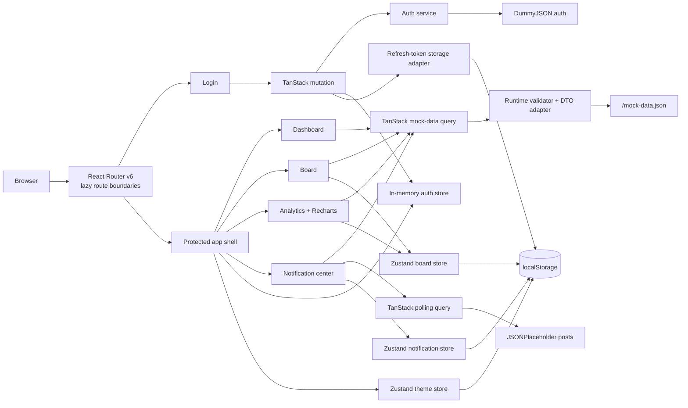
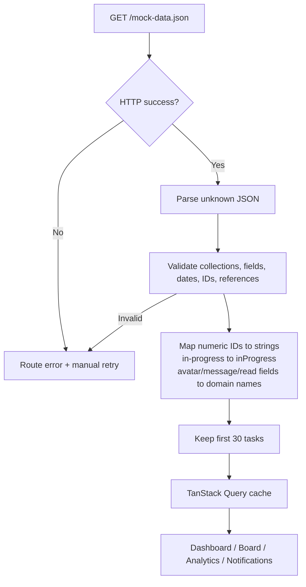
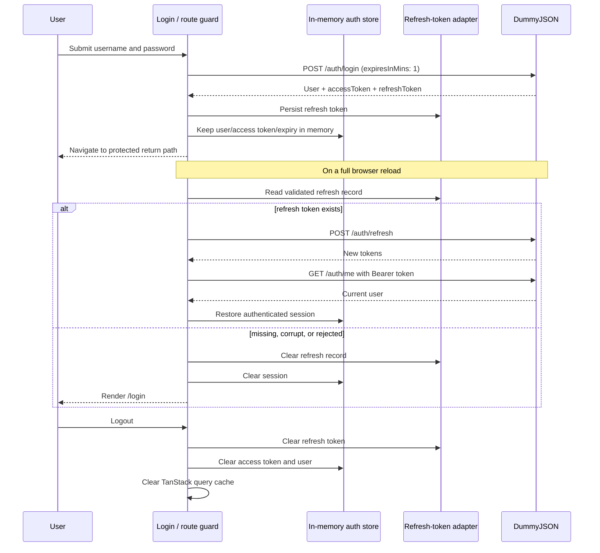
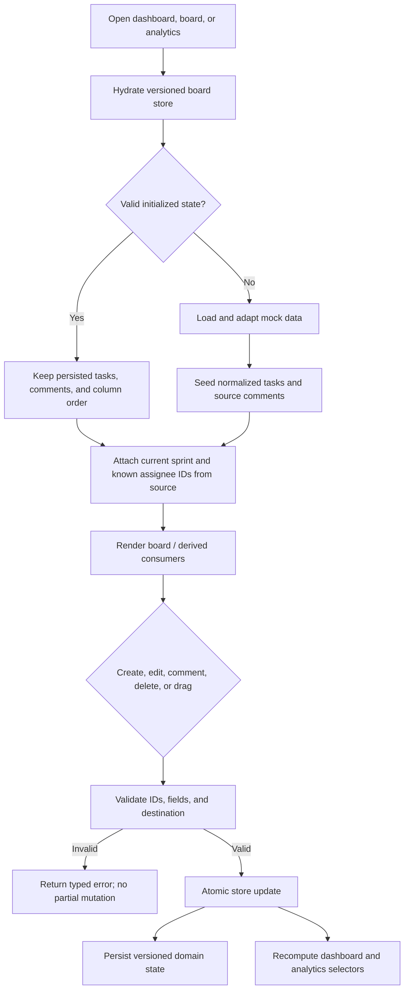
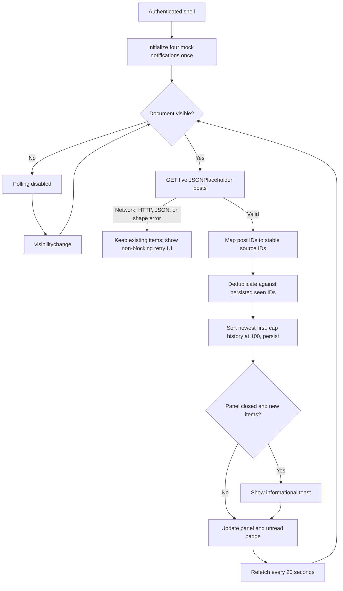

# SprintDesk architecture

## System view

Routes are lazy-imported in `src/app/App.tsx`. The protected shell is a separate lazy boundary. Recharts is imported only by `src/features/analytics/Analytics.tsx`, so chart code stays out of the login, dashboard, and board route chunks.

## Route structure

| Route | Guard | Main responsibility |
|---|---|---|
| `/login` | Guest only | Credentials and login mutation. |
| `/dashboard` | Authenticated | Current sprint and current-board summary. |
| `/board` | Authenticated | Persisted task workflow and comments. |
| `/analytics` | Authenticated | Board/source-derived charts and accessible summaries. |
| `*` | — | Redirect to `/login`; guards then resolve the correct destination. |

## State ownership

| State | Owner | Persistence |
|---|---|---|
| Mock dataset fetch/result | TanStack Query | Memory cache for the page lifetime; infinite stale time. |
| Notification poll lifecycle/error | TanStack Query | None. |
| Login mutation lifecycle/error | TanStack Query | None. |
| Access token, expiry, user, auth status/generation | Zustand auth store | Memory only. |
| Refresh token | Dedicated storage adapter | `sprintdesk.auth.refresh.v1` in localStorage. |
| Tasks, column order, comments | Zustand board store | Versioned `sprintdesk.board.v1` localStorage record. |
| Notifications, seen source IDs, read timestamps | Zustand notification store | Versioned `sprintdesk.notifications.v1` localStorage record. |
| Theme preference | Zustand theme store | Versioned `sprintdesk.theme.v1` localStorage record. |
| Forms, open overlays, current notification page, active drag | React component state | None. |
| Analytics chart models | Pure selectors | None; recomputed from board/source data. |

Board and notification persistence validate/migrate their records before use and fall back to in-memory state with a visible warning if durable storage is unavailable.

## Data loading and adaptation

Feature components consume domain models, never source DTOs. The checked-in source remains unmodified; its SHA-256 is recorded in the README and submission checklist.

## Authentication lifecycle

The authenticated fetch wrapper attaches exactly one Bearer token, pre-emptively refreshes near expiry, coordinates concurrent refreshes through a single promise, and retries a replayable request once after a 401. Streaming or already-consumed bodies are rejected rather than retried unsafely. Session generations prevent an old request from reviving a logged-out/replaced session.

## Board lifecycle

`columnTaskIds` is the sole ordering authority after hydration. Moving into Done creates `completedAt` if needed; moving out clears it. Deleting a task also removes its column reference and comments.

## Notification lifecycle

The visible panel pages 20 items at a time. Seen IDs retain bounded tombstones so an evicted notification is not immediately re-added by the static poll.

## Tradeoffs

- Browser storage makes the assignment self-contained but is not multi-user persistence or secure session storage.
- The source adapter rejects malformed data early instead of attempting partial rendering.
- Query retries are disabled. Authentication performs one explicit retry only after a coordinated refresh; user-facing data errors expose manual retry controls.
- Route splitting is preferred over blanket memoization. Analytics owns its larger chart dependency, while shared UI/store chunks remain cacheable.
